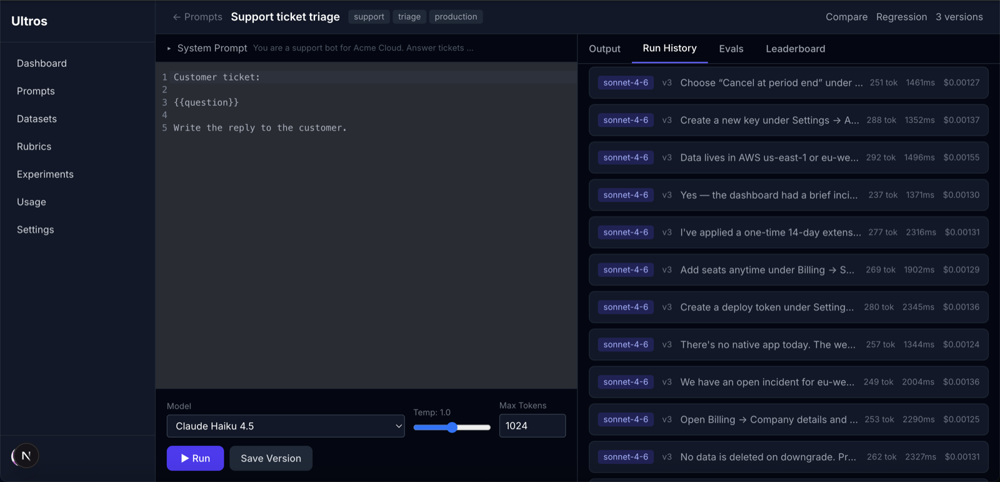
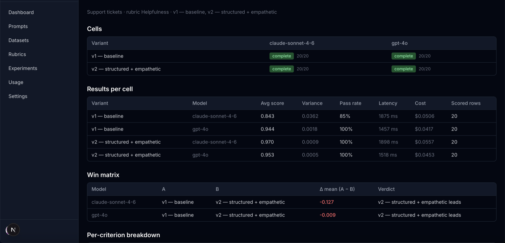
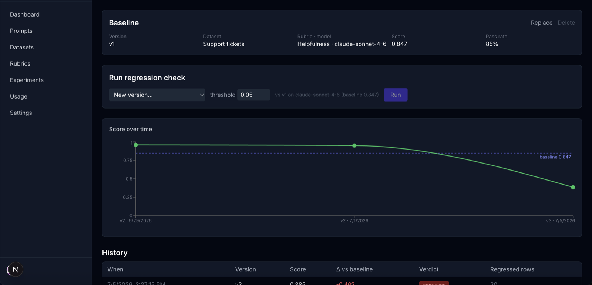
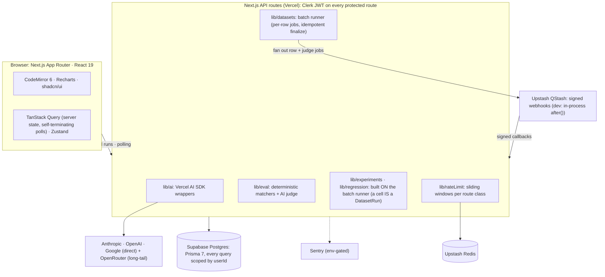
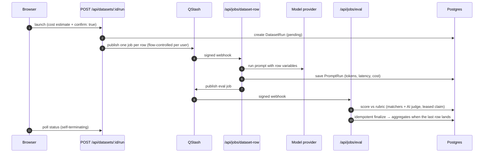
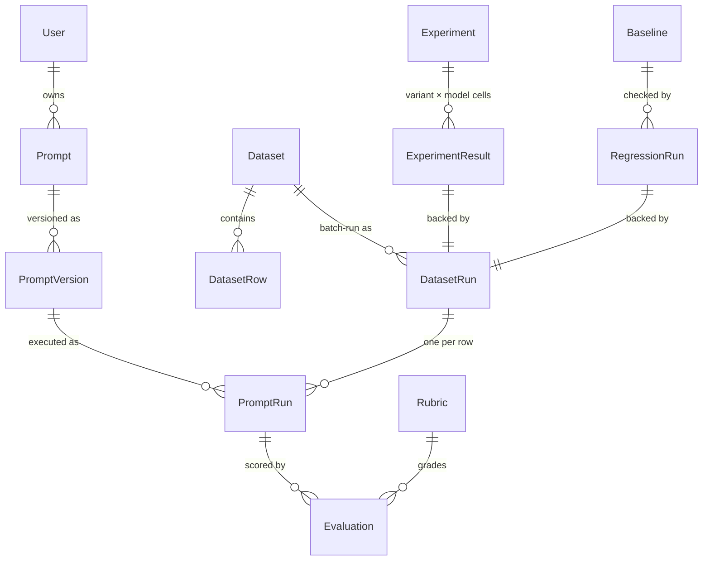

# Ultros

[](https://github.com/dy1an-nt/Ultros/actions/workflows/ci.yml)
[](LICENSE)

**AI evaluation and prompt experimentation platform.** Test prompts against multiple models, run them across datasets, score every output automatically (AI-as-judge + deterministic rubrics), and catch performance regressions between prompt versions, before your users do.

Positioned alongside LangSmith / HumanLoop / PromptLayer: every run is a first-class, scored, tracked experiment.

**Live at [ultros.vercel.app](https://ultros.vercel.app).** No account needed to see real output: [this shared experiment](https://ultros.vercel.app/share/pXilc3XRgfl69SECGxsFzYEubQeQD0SH) compares two prompt versions across Claude and GPT-4o on a 20-row dataset, scored and laid out in a win matrix.



## What it does

- **Prompt workspace.** CodeMirror editor with system-prompt builder, `{{variable}}` templating, streaming runs, and full version history with diff/restore.
- **Multi-model.** Claude, GPT, and Gemini direct (prompt caching / batch-friendly paths) plus OpenRouter for the long-tail catalog. Side-by-side comparison across 3 models.
- **Evaluation engine.** Rubrics combine AI-as-judge criteria with deterministic matchers (exact, regex, JSON schema, contains). Judge calls run async through QStash; every batch row is auto-scored.
- **Dataset testing.** Upload CSV/JSON (≤ 500 rows), map columns to template variables, fan out a prompt version across every row with live progress, aggregates (mean, sample variance, pass rate, latency, cost), per-row drill-down, CSV export.
- **Experiments.** A/B/C/D variants × up to 3 models over a dataset; win matrix (pairwise difference of means), per-criterion breakdown, cell-level drill-down.
- **Regression testing.** Pin a baseline run; any new version re-runs the same dataset/rubric/model and reports the score delta, a regressed verdict against a threshold, and *exactly which rows* flipped or dropped, plus a score-over-time chart.
- **Launch hardening.** Share-via-link (read-only, revocable, never indexed), per-route-class rate limiting, monthly budget banner + confirm, usage CSV export, Sentry + Vercel Analytics.

## Screenshots

| | |
|---|---|
|  *Experiments: per-cell results + win matrix* |  *Regression testing: baseline, catch, score over time* |

## Architecture



### Async evaluation pipeline

Every dataset run, experiment cell, and regression check flows through the same batch runner:



### Data model (core)



Key design decisions are documented per sprint in [`docs/sprint-summary/`](docs/sprint-summary/). Each sprint has an architect contract and a teaching write-up. A cross-cutting adversarial pass lives in [`docs/security-audit-2026-07-06.md`](docs/security-audit-2026-07-06.md).

## Local setup

```bash
npm install
cp .env.example .env.local   # fill in the table below
npx prisma migrate dev       # or: node node_modules/prisma/build/index.js migrate dev
npm run dev
```

> Supabase note: if `DIRECT_URL` (the `db.<ref>.supabase.co` host) is unreachable from your network (it is IPv6-only), run migrations through the IPv4 session pooler: same credentials, host `aws-<region>.pooler.supabase.com`, port `5432`.

In development, batch jobs run in-process (sequential `after()` loop) because QStash cannot reach localhost. Production uses signed QStash webhooks with per-user flow control.

## Environment variables

| Variable | Purpose | Required |
|---|---|---|
| `DATABASE_URL` | Supabase pooled connection (port 6543) | yes |
| `DIRECT_URL` | Direct connection for migrations | yes |
| `DB_PASSWORD` | DB password (injected by `prisma.config.ts`) | yes |
| `NEXT_PUBLIC_CLERK_PUBLISHABLE_KEY` / `CLERK_SECRET_KEY` | Clerk auth | yes |
| `CLERK_WEBHOOK_SECRET` | Svix signature for user sync | yes |
| `ANTHROPIC_API_KEY` | Claude direct | ≥ 1 provider |
| `OPENAI_API_KEY` | GPT direct | optional |
| `GOOGLE_GENERATIVE_AI_API_KEY` | Gemini direct | optional |
| `OPENROUTER_API_KEY` | Long-tail catalog | optional |
| `UPSTASH_REDIS_REST_URL` / `UPSTASH_REDIS_REST_TOKEN` | Rate limiting (fails open if absent) | prod |
| `UPSTASH_QSTASH_TOKEN` | Job queue publish | prod |
| `QSTASH_CURRENT_SIGNING_KEY` / `QSTASH_NEXT_SIGNING_KEY` | Job webhook verification (503 until set) | prod |
| `SENTRY_DSN` / `NEXT_PUBLIC_SENTRY_DSN` | Error monitoring (no-op if absent) | prod |
| `NEXT_PUBLIC_APP_URL` | Absolute URL for QStash callbacks + share links | prod |

## Testing

CI gates every push: lint, typecheck, unit tests, integration tests against a fresh Postgres (migration check included), and a production build.

```bash
npm test                  # 127 unit tests: the pure core (lib/**) plus component and hook suites in jsdom
npm run test:integration  # 222 route-level integration tests against local Postgres
npm run typecheck
```

Component and hook suites sit next to what they cover (`components/**/*.test.tsx`,
`hooks/**/*.test.tsx`) and opt into jsdom per file, so the `lib` suites keep the
faster node environment.

## Conventions

- API responses are always `{ data, error }`; costs in USD floats (`costUsd`), tokens as integers, latency in ms.
- Every protected query is scoped by the Clerk-derived `userId`; cross-user ids return 400/404 without an existence leak.
- Expensive launches (dataset runs, experiments) require a cost estimate + `confirm: true`.
- Rate limits per class: runs 30/min, evals 60/min, launches 5/min, mutations 60/min, public share views 60/min/IP, 429 + `Retry-After`.
- Public share payloads are allowlist-built in `lib/share/resolve.ts`; nothing else constructs them.

## How this was built

I built Ultros with Claude Code, one sprint at a time. The commit trailers record it, and the workflow is in `.claude/`.

It is role-separated rather than one long conversation. Every sprint opens with a written contract in `docs/sprint-summary/`: requirements, schema changes, and the full API shape with request and response examples. Backend and frontend are then built against that contract, so neither side reads the other's code to learn the interface. An adversarial security review runs over the diff before anything is committed, and it writes its findings to a file before any fix is applied, so the review cannot be quietly softened by the patch that follows. Functional QA runs after that, and only then does the sprint get committed in scoped pieces.

The gates are the part that matters. Nothing counts as done until `npm run typecheck` is clean and the integration suite passes against a real Postgres, and CI enforces both on every push along with a migration replay from scratch.

[`docs/security-audit-2026-07-06.md`](docs/security-audit-2026-07-06.md) is one of those adversarial passes, published with its findings intact. It caught three logging paths that skipped the secret scrubber and a rate limiter keyed on a spoofable header. Both are fixed now, and the second one shipped with the regression tests in `lib/rateLimit.test.ts`.

## Demo

[Shared experiment result](https://ultros.vercel.app/share/pXilc3XRgfl69SECGxsFzYEubQeQD0SH), read-only and no sign-in. This is the share-via-link feature itself, an allowlisted public payload built in `lib/share/resolve.ts` and revocable at any time.

To run your own prompts, sign in at [ultros.vercel.app](https://ultros.vercel.app). [`docs/demo-script.md`](docs/demo-script.md) has the under-4-minute walkthrough: prompt, rubric, dataset run, experiment, regression catch.

## License

[MIT](LICENSE)
